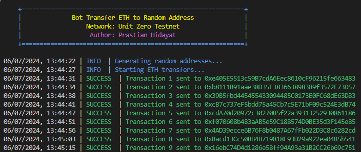

# UNITS NETWORK TESTNET


## Description
Script bot ini adalah script auto transfer ETH ke random adress di Jaringan Units Testnet. 

## Persiapan
1. Pastikan sudah menginstall NodeJS . Kalau belum bisa [install disini](https://nodejs.org/en/download/package-manager/current)
2. Join Program [Testnet Units Network](https://app.units.network/?referral=0x000000DE3b4CD31742711440C1283b162035E00E)
3. Claim [FAUCET](https://faucet-testnet.unit0.dev/)

# Feature
- Auto transfer to random address
- Default is 100,000 random address
- Support logs Timeswap dan SUCCESS

## Installation for JS
### Clone Repositori
```
git clone https://github.com/PrastianHD/units-testnet.git
cd units-testnet
```

### Instal Dependensi
```
npm install
```

### Konfigurasi .env File

>buat file .env di root projek
```bash
RPC_URL="https://rpc-testnet.unit0.dev"

PRIVATE_KEY="your_private_key"
```

### Run script
```
npm start
```
## Installation for PY using TERMUX
### Instal Preparation
```
pkg update
pkg upgrade -y
pkg install git
pkg install python
```
### Clone Repositori
```
git clone https://github.com/PrastianHD/units-testnet.git
cd units-testnet
```

### Install Requirements
```
pip install -r requirements.txt
```

### Run Script
```
python main.py
```

